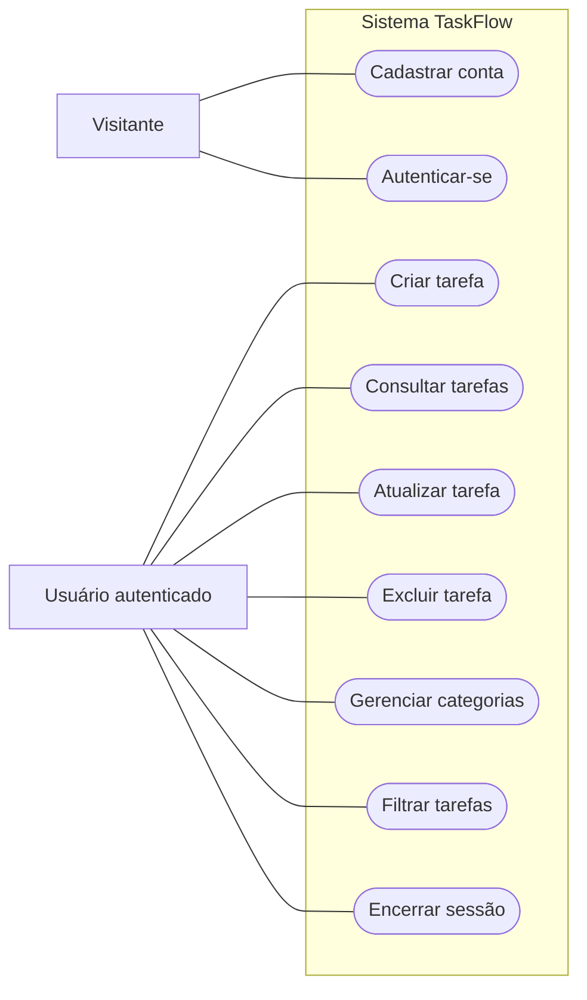

# TaskFlow - Diagrama de Casos de Uso

```mermaid
flowchart LR
    V["Visitante"]
    U["Usuário autenticado"]

    subgraph TF["Sistema TaskFlow"]
        UC1(["Cadastrar conta"])
        UC2(["Autenticar-se"])
        UC3(["Criar tarefa"])
        UC4(["Consultar tarefas"])
        UC5(["Atualizar tarefa"])
        UC6(["Excluir tarefa"])
        UC7(["Gerenciar categorias"])
        UC8(["Filtrar tarefas"])
        UC9(["Encerrar sessão"])
    end

    V --- UC1
    V --- UC2

    U --- UC3
    U --- UC4
    U --- UC5
    U --- UC6
    U --- UC7
    U --- UC8
    U --- UC9
```
